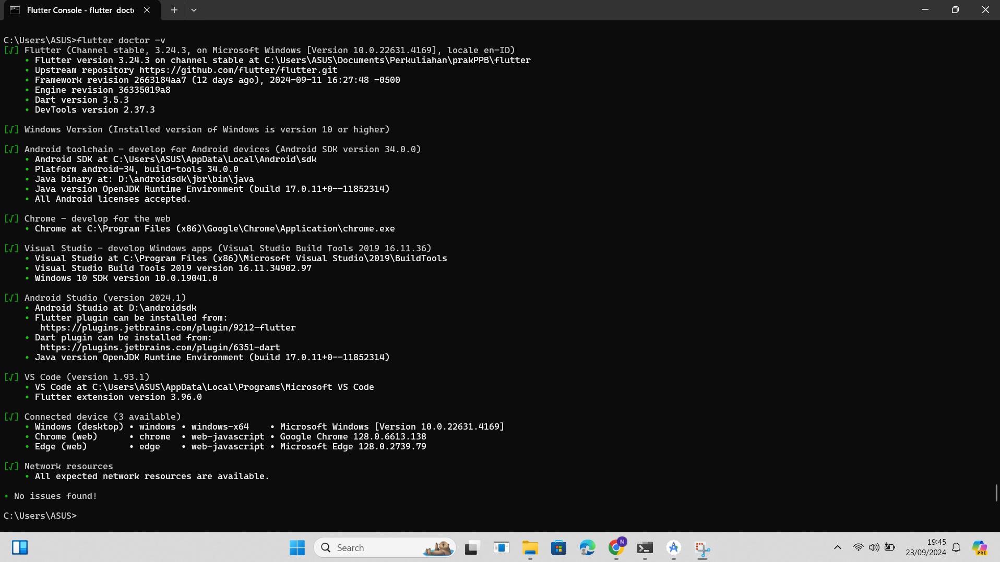
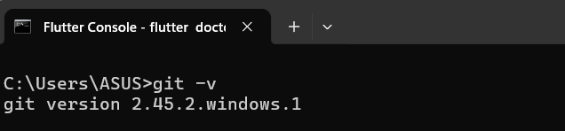
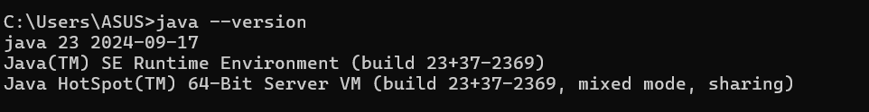

## PPB_Naufal Maulana Izzuddin_2211104081_SE-06-C/01_Running-Modul/LP_01

<li> Nama   : Naufal Maulana Izzuddin
<li> NIM    : 2211104091
<li> Kelas  : SE-06-02

# Instalasi Flutter
<li> screenshot flutter sudah terinstall

# Cek FLutter

# Instalasi JDK
<li> Screenshot jdk lewat cmd

# Instalasi Android Studio
<li> Screenshot android studio sudah terinstall

# Instalasi Git
<li> Screenshot bukti terinstall git melalui cmd

# Installasi Extensions pada visual studio code
<li> Screenshot visual studio code dan extensions "Dart" juga "Flutter"

 

