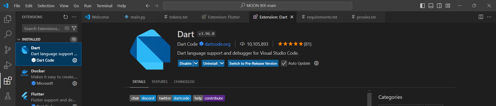
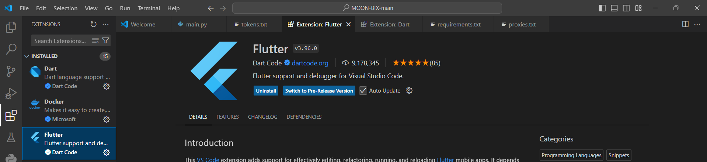

**LAPORAN PRAKTIKUM**  
**PEMROGRAMAN PERANGKAT BERGERAK**

**MODUL 1**  
**RUNNING MODUL**

Disusun Oleh :

**NAUFAL MAULANA IZZUDDIN (2211104091)**  
**SE06-02**

Asisten Praktikum :  
Mas Faza  
Mba Hasna

Dosen Pengampu :  
Yudha Islami Sulistya, S.Kom., M.Cs

PROGRAM STUDI S1 REKAYASA PERANGKAT LUNAK  
FAKULTAS INFORMATIKA  
TELKOM UNIVERSITY PURWOKERTO  
2024

# Instalasi Flutter
<li> screenshot flutter sudah terinstall

# Cek FLutter

# Instalasi JDK
<li> Screenshot jdk lewat cmd

# Instalasi Android Studio
<li> Screenshot android studio sudah terinstall

# Instalasi Git
<li> Screenshot bukti terinstall git melalui cmd

# Installasi Extensions pada visual studio code
<li> Screenshot visual studio code dan extensions Dart

 
<li> extention flutter VScode
  

