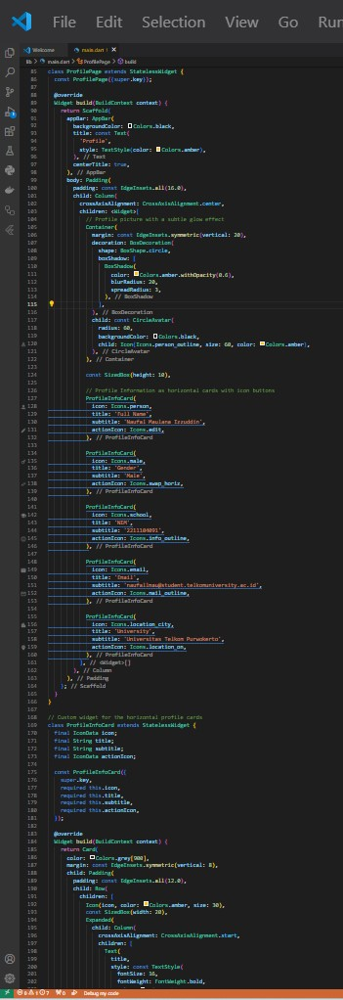

**LAPORAN PRAKTIKUM**  
**PEMROGRAMAN PERANGKAT BERGERAK**

**MODUL 2**  
**PENGENALAN FLUTTER**

Disusun Oleh :

**NAUFAL MAULANA IZZUDDIN (2211104091)**  
**SE06-02**

Asisten Praktikum :  
Mas Faza  
Mba Hasna

Dosen Pengampu :  
Yudha Islami Sulistya, S.Kom., M.Cs

PROGRAM STUDI S1 REKAYASA PERANGKAT LUNAK  
FAKULTAS INFORMATIKA  
TELKOM UNIVERSITY PURWOKERTO  
2024

## 1. Jelaskan apa itu Dart & Flutter beserta contoh widget yang ada pada Flutter.

- **Dart** Dart adalah bahasa pemrograman yang powerful dan fleksibel, sangat cocok untuk pengembangan aplikasi modern di berbagai platform. Dengan sintaks yang bersih dan fitur yang kuat, Dart memberikan pengalaman pengembangan yang menyenangkan dan produktif. Keberhasilan Dart dalam pengembangan aplikasi mobile dengan Flutter menunjukkan potensinya dalam dunia pengembangan perangkat lunak..

- **Flutter** adalah framework yang kuat dan fleksibel untuk pengembangan aplikasi multi-platform. Dengan kemudahan penggunaan, performa yang tinggi, dan kemampuan untuk membuat antarmuka yang menarik, Flutter menjadi pilihan yang sangat menarik bagi pengembang yang ingin membuat aplikasi mobile dan web modern.

## 2. Buatlah sebuah project Flutter.

## 3. Setelah project dibuat, jalankan di emulator atau pada real device. Jika tampilan project Flutter muncul seperti gambar di bawah ini, maka project telah berhasil dijalankan.

## 4. Code Project Flutter Biodata

## 5. Setelah berhasil, modifikasi halaman di atas untuk menampilkan biodata kalian, minimal 5 widget!! (bebas, buatlah sekreatif mungkin).

