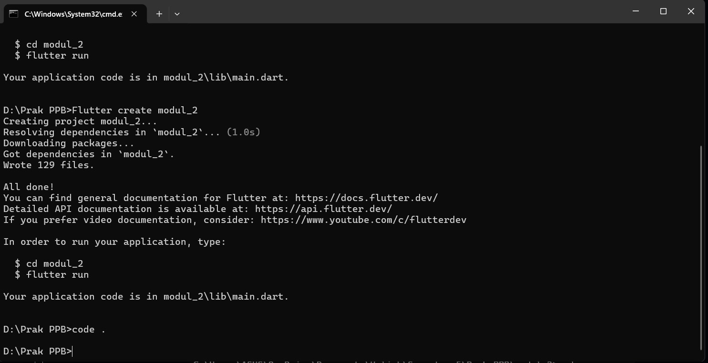
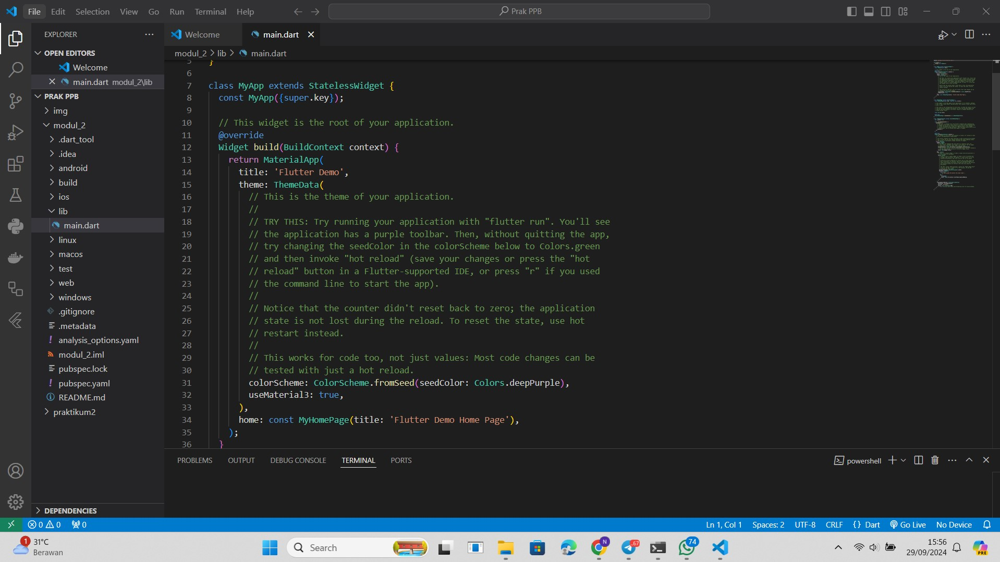
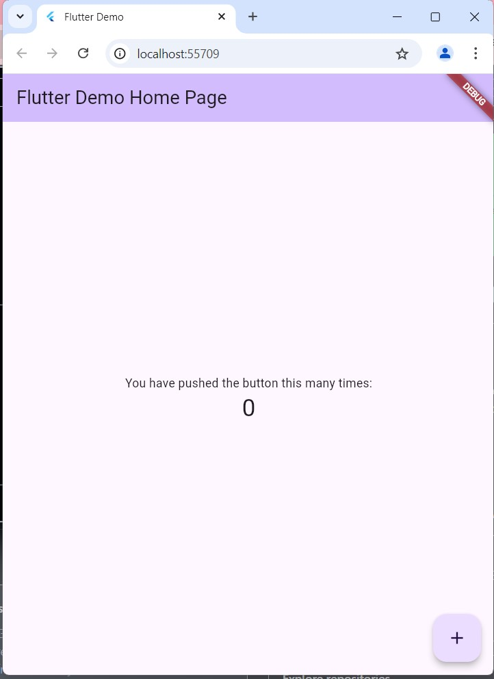
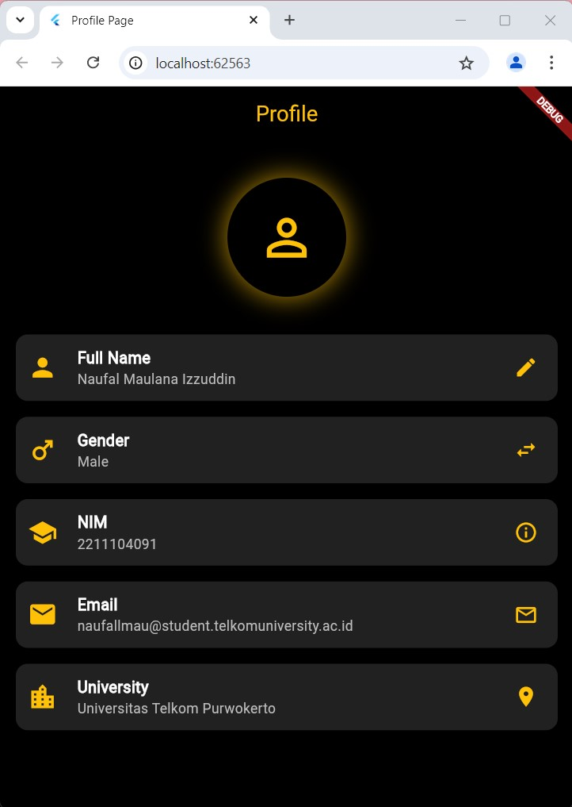

# PPB_Naufal Maulana Izzuddin_2211104091_SE-06-02/02_Pengenalan-Flutter/LP_02

- **Nama**: Naufal Maulana Izzuddin
- **NIM**: 2211104091
- **Kelas**: SE-06-02

## 1. Jelaskan apa itu Dart & Flutter beserta contoh widget yang ada pada Flutter.

- **Dart** Dart adalah bahasa pemrograman yang powerful dan fleksibel, sangat cocok untuk pengembangan aplikasi modern di berbagai platform. Dengan sintaks yang bersih dan fitur yang kuat, Dart memberikan pengalaman pengembangan yang menyenangkan dan produktif. Keberhasilan Dart dalam pengembangan aplikasi mobile dengan Flutter menunjukkan potensinya dalam dunia pengembangan perangkat lunak..

- **Flutter** adalah framework yang kuat dan fleksibel untuk pengembangan aplikasi multi-platform. Dengan kemudahan penggunaan, performa yang tinggi, dan kemampuan untuk membuat antarmuka yang menarik, Flutter menjadi pilihan yang sangat menarik bagi pengembang yang ingin membuat aplikasi mobile dan web modern.

## 2. Buatlah sebuah project Flutter.

## 3. Setelah project dibuat, jalankan di emulator atau pada real device. Jika tampilan project Flutter muncul seperti gambar di bawah ini, maka project telah berhasil dijalankan.

## 4. Setelah berhasil, modifikasi halaman di atas untuk menampilkan biodata kalian, minimal 5 widget!! (bebas, buatlah sekreatif mungkin).

